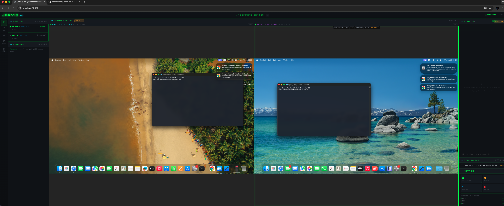
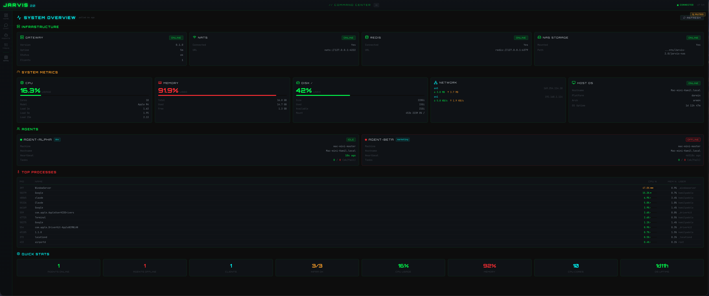
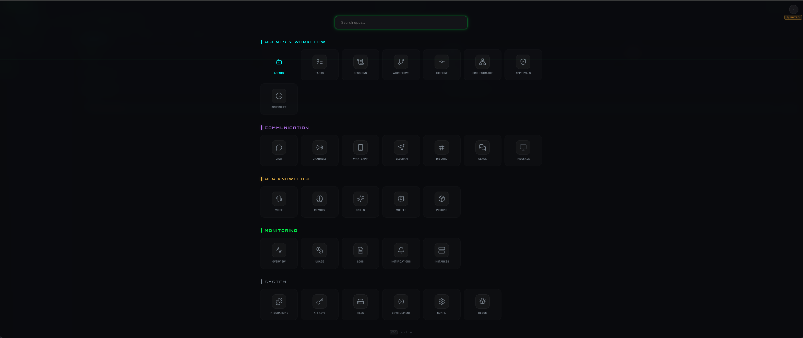
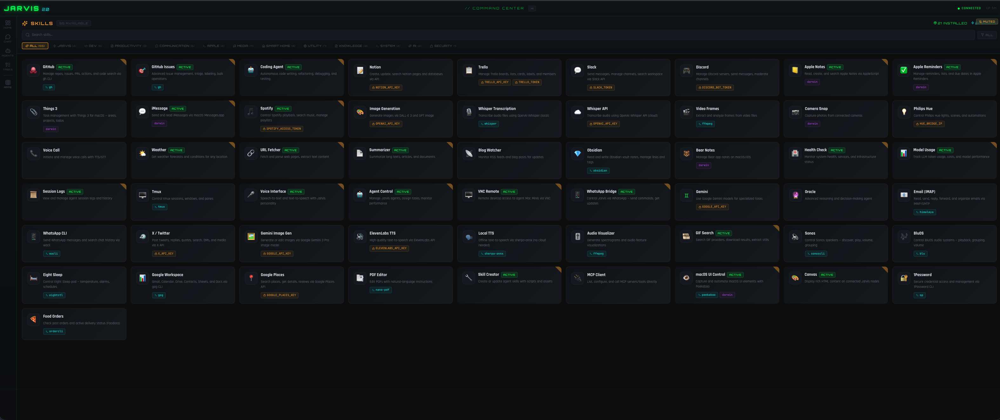

<div align="center">


<br>

<a href="https://readme-typing-svg.demolab.com">
  
</a>

<br><br>

[](https://typescriptlang.org)
[](https://nodejs.org)
[](https://react.dev)
[](https://nats.io)
[](https://redis.io)
[](https://anthropic.com)
[]()
[](https://jarvis2-website.web.app)

</div>


```
╔══════════════════════════════════════════════════════════════════════════════╗
║  JARVIS SYSTEM v2.0.0  ◆  STATUS: OPERATIONAL  ◆  NODES: 3  ◆  UPLINK: OK ║
╚══════════════════════════════════════════════════════════════════════════════╝
```

> `33+ TOOLS LOADED` | `12 PLUGINS ACTIVE` | `31 DASHBOARD VIEWS` | `50+ SKILLS AVAILABLE`

A personal AI infrastructure running on dedicated Mac Mini hardware — coordinating multiple autonomous agents through NATS messaging, Redis state, and a cyberpunk-themed real-time dashboard. Unlike cloud-only AI assistants, Jarvis operates on your own hardware with full access to your local environment — files, applications, shell, network, and macOS APIs.


## ░ ARCHITECTURE

```
╔══════════════════════════════════════════════════════════════════════════════════╗
║                             JARVIS 2.0 PLATFORM                                ║
╠══════════════════════════════════════════════════════════════════════════════════╣
║                                                                                ║
║   ┌────────────┐  ┌────────────┐                                               ║
║   │  DASHBOARD │  │  CLI/API   │             ◆ USER INTERFACES                 ║
║   │  React 19  │  │  REST/WS   │                                               ║
║   └─────┬──────┘  └─────┬──────┘                                               ║
║         │ WS             │ HTTP                                                 ║
║         └───────┬────────┘                                                     ║
║                 ▼                                                               ║
║          ┌─────────────┐                                                        ║
║          │   GATEWAY   │◄════► ┌───────┐                                        ║
║          │   Node.js   │       │ REDIS │                                        ║
║          └──────┬──────┘       │ State │                                        ║
║                 │              └───────┘                                         ║
║                 ▼                                                                ║
║          ┌─────────────┐                                                        ║
║          │    NATS     │          ◆ MESSAGE BUS                                 ║
║          │   Pub/Sub   │                                                        ║
║          └──┬───┬───┬──┘                                                        ║
║             │   │   │                                                           ║
║     ┌───────┘   │   └───────┐                                                   ║
║     ▼           ▼           ▼                                                   ║
║  ┌──────────┐ ┌──────────┐ ┌──────────┐                                         ║
║  │  JARVIS  │ │  SMITH   │ │  JOHNY   │  ◆ AGENTS                              ║
║  │ Orchest. │ │   Dev    │ │Marketing │                                         ║
║  │  Master  │ │ Mac Mini │ │ Mac Mini │                                         ║
║  └──────────┘ └────┬─────┘ └────┬─────┘                                         ║
║       ▲            │            │                                                ║
║       │            └─────┬──────┘                                                ║
║       │    delegates     │  communicate                                          ║
║       └──────────────────┘                                                       ║
║                                                                                  ║
║                 ┌─────────────┐                                                  ║
║                 │     NAS     │   ◆ SHARED STORAGE                               ║
║                 │   Storage   │                                                  ║
║                 └─────────────┘                                                  ║
║                                                                                  ║
╚══════════════════════════════════════════════════════════════════════════════════╝
```

| Component | Description |
|:----------|:------------|
| `GATEWAY` | Central HTTP/WebSocket server — routes requests, manages state, serves dashboard |
| `DASHBOARD` | React 19 SPA with cyberpunk theme — real-time monitoring, chat, task management |
| `CLI/API` | REST/WebSocket interface for programmatic access and command-line control |
| `JARVIS` | Orchestrator agent — manages, delegates, and coordinates Smith & Johny |
| `SMITH` | Dev agent — coding, builds, deploys (Mac Mini) |
| `JOHNY` | Marketing agent — research, content, social media (Mac Mini) |
| `NATS` | High-performance message bus — inter-agent communication |
| `REDIS` | Task queue, agent state, session storage |
| `NAS` | Shared network storage for configs, sessions, artifacts, memory |


## ░ FEATURES

<details>
<summary><b>Multi-Agent Orchestration</b></summary>
<br>

- Multiple autonomous agents running on dedicated Mac Mini nodes
- Task delegation — agents can assign subtasks to other agents based on capabilities
- Priority queues (critical/high/normal/low) with Redis-backed state
- Dependency orchestration — tasks with prerequisites, automatic unblocking
- Human-in-the-loop approvals for sensitive operations

</details>

<details>
<summary><b>Real-Time Dashboard</b></summary>
<br>

- Cyberpunk-themed UI with matrix green palette, glow effects, and scanline overlay
- 31 views — Agents, Chat, Tasks, Sessions, Workflows, Timeline, Orchestrator, and more
- Fullscreen App Launcher — macOS Launchpad-style navigation with 5 categorized groups
- Live WebSocket updates — agent heartbeats, task progress, chat messages
- Code-split routing — React.lazy() for all views with Suspense loading

</details>

<details>
<summary><b>AI Chat Interface</b></summary>
<br>

- Full Markdown rendering — headers, lists, tables, code blocks with syntax highlighting
- Message search (Ctrl+F) with match highlighting and result count
- Auto-session naming from first user message
- Inline message editing and resend
- Heartbeat latency indicator — real-time connection health
- Streaming protection — beforeunload warning during active responses

</details>

<details>
<summary><b>Communication Channels</b></summary>
<br>

- **iMessage** — Full messenger interface with contact list from Contacts.app, chat threads with bubbles, compose mode, AppleScript integration
- **WhatsApp** — Bridge for sending commands and receiving updates
- **Telegram** — Bot integration for remote agent control
- **Discord** — Server management and messaging
- **Slack** — Workspace integration
- Native **voice interface** with TTS/STT

</details>

<details>
<summary><b>Skills Marketplace</b></summary>
<br>

- 50+ skills across 12 categories (Dev, Apple, Media, Smart Home, AI, Security...)
- Visual browser with install/enable toggles
- Requirement detection (binaries, env vars, platform)
- Categories: Jarvis, Dev, Productivity, Communication, Apple, Media, Smart Home, Utility, Knowledge, System, AI, Security

</details>


## ░ CAPABILITIES

> `AGENT TOOLSET // 33+ INTEGRATED TOOLS`

| Tool | Function |
|:-----|:---------|
| `exec` | Shell command execution with sandboxing |
| `read` / `write` / `edit` / `list` / `search` | Full filesystem access |
| `browser` / `web_fetch` / `web_search` | Web browsing and research |
| `ssh_exec` | Remote command execution across machines |
| `computer` | VNC-based GUI automation (mouse, keyboard, screenshots) |
| `imessage` | Send/read iMessages, search conversations |
| `spotify` | Playback control, search, playlists |
| `cron` | Schedule recurring tasks |
| `calendar` | macOS Calendar integration |


## ░ PLUGINS

> `PLUGIN REGISTRY // 12 MODULES LOADED`

| Status | Plugin | Description |
|:------:|:-------|:------------|
| `[ON]` | `jarvis-memory` | Persistent agent memory with NAS-backed storage |
| `[ON]` | `jarvis-metrics` | Token usage tracking, cost monitoring, performance stats |
| `[ON]` | `jarvis-auto-save` | Automatic session saves and artifact management |
| `[ON]` | `jarvis-task-planner` | Task decomposition, delegation, and tracking |
| `[ON]` | `jarvis-notifications` | Push notifications for task completion and alerts |
| `[ON]` | `jarvis-workflow-engine` | Multi-step workflow definitions and execution |
| `[ON]` | `jarvis-system-monitor` | CPU, memory, disk monitoring with alerts |
| `[ON]` | `activity-timeline` | Agent activity logging and visualization |
| `[ON]` | `health-check` | Service health monitoring with automatic baselines |
| `[ON]` | `rate-limiter` | API rate limiting (60/min, 500/session, 500K tokens) |
| `[ON]` | `voice` | Speech-to-text and text-to-speech interface |
| `[ON]` | `jarvis-obsidian` | Obsidian vault integration (search, read, write, daily notes) |


## ░ SCREENSHOTS

<div align="center">

<table>
<tr>
<td align="center" width="50%">

<br>
<b><code>COMMAND CENTER</code></b>
<br>
<samp>Remote control with dual-machine view — live terminal streams, agent chat, task queue, and real-time metrics all in one panel.</samp>
</td>
<td align="center" width="50%">

<br>
<b><code>SYSTEM OVERVIEW</code></b>
<br>
<samp>Infrastructure health at a glance — Gateway, NATS, Redis, NAS status, CPU/Memory/Disk metrics, agent heartbeats, top processes.</samp>
</td>
</tr>
<tr>
<td align="center" width="50%">

<br>
<b><code>APP LAUNCHER</code></b>
<br>
<samp>Fullscreen Launchpad-style navigation with 5 categorized groups, fuzzy search, and 4K-optimized icon tiles.</samp>
</td>
<td align="center" width="50%">

<br>
<b><code>SKILLS MARKETPLACE</code></b>
<br>
<samp>50+ skills across 12 categories — GitHub, iMessage, Spotify, Image Gen, Voice, Obsidian, Smart Home, and more.</samp>
</td>
</tr>
</table>

</div>


## ░ SYSTEM_MANIFEST

```
╔═══════════════════════════════════════════════════════════════╗
║  SYSTEM MANIFEST                                             ║
╠════════════════════╦══════════════════════════════════════════╣
║  Language          ║  TypeScript 5.x (strict mode)           ║
║  Runtime           ║  Node.js 22+                            ║
║  Monorepo          ║  pnpm workspaces                        ║
║  Frontend          ║  React 19, Vite 6, Zustand, Router 7   ║
║  Backend           ║  Express, WebSocket (ws)                ║
║  Messaging         ║  NATS (Thunderbolt 10Gbps priority)     ║
║  Storage           ║  Redis 7, JSONL files, NAS              ║
║  AI                ║  Claude Opus 4.6, OpenAI (secondary)    ║
║  Build             ║  tsdown, Vite                           ║
║  Icons             ║  lucide-react                           ║
║  Platform          ║  macOS (AppleScript, Messages, Contacts)║
╚════════════════════╩══════════════════════════════════════════╝
```


## ░ DASHBOARD_VIEWS

> `31 VIEWS // REAL-TIME MONITORING & CONTROL`

| View | Description |
|:-----|:------------|
| `Home` | System overview with agent status, recent activity |
| `Chat` | AI chat with Markdown rendering, search, editing |
| `Agents` | Agent monitoring — status, capabilities, heartbeat |
| `Tasks` | Task queue management — create, assign, track |
| `Sessions` | Session history and replay |
| `Workflows` | Multi-step workflow builder |
| `Timeline` | Activity timeline across all agents |
| `Orchestrator` | Task dependency graph visualization |
| `Approvals` | Human-in-the-loop approval queue |
| `Scheduler` | Cron-based task scheduling |
| `iMessage` | Full messenger with contacts and chat threads |
| `WhatsApp / Telegram / Discord / Slack` | Channel integrations |
| `Voice` | Speech interface controls |
| `Memory` | Agent memory browser and search |
| `Skills` | Skill marketplace with 50+ skills |
| `Providers` | LLM model configuration |
| `Plugins` | Plugin management |
| `Overview` | System metrics and charts |
| `Usage` | Token usage and cost tracking |
| `Logs` | Real-time log viewer |
| `Notifications` | Alert management |
| `Instances` | Hardware node monitoring |
| `Integrations` | Third-party service status |
| `API Keys` | Credential management |
| `Files` | NAS file browser |
| `Environment` | Environment variable management |
| `Config` | System configuration |
| `Debug` | Debug tools and diagnostics |


## ░ HARDWARE

```
                    ┌─────────────────────────────────┐
                    │         NETWORK TOPOLOGY         │
                    └────────────────┬────────────────┘
                                     │
                 ┌───────────────────┼───────────────────┐
                 │                   │                   │
        ┌────────┴────────┐ ┌───────┴────────┐ ┌───────┴────────┐
        │   MAC MINI M2   │ │  MAC MINI M2   │ │  MAC MINI M2   │
        │    (Master)     │ │  (Agent Alpha) │ │  (Agent Beta)  │
        │    16GB RAM     │ │                │ │                │
        ├─────────────────┤ ├────────────────┤ ├────────────────┤
        │ ◆ Gateway       │ │ ◆ Dev Agent    │ │ ◆ Marketing    │
        │ ◆ NATS Server   │ │ ◆ Coding       │ │ ◆ Research     │
        │ ◆ Redis         │ │ ◆ Builds       │ │ ◆ Content      │
        │ ◆ Dashboard     │ │ ◆ Deploys      │ │ ◆ Social Media │
        └────────┬────────┘ └───────┬────────┘ └───────┬────────┘
                 │                   │                   │
                 │  ◄══ Thunderbolt 10Gbps ══►          │
                 │                   │      ◄══ Ethernet 1Gbps ══►
                 │                   │                   │
                 └───────────────────┼───────────────────┘
                                     │
                          ┌──────────┴──────────┐
                          │     NAS STORAGE     │
                          │  Configs │ Sessions │
                          │  Memory  │ Artifacts│
                          └─────────────────────┘
```


## ░ QUICK_START

```bash
# ── Prerequisites ──────────────────────────────────────────────
# macOS (required for iMessage, Contacts, AppleScript)
# Node.js 22+  |  pnpm 10+  |  Anthropic API Key

# ── Install Infrastructure ─────────────────────────────────────
brew install nats-server redis

# ── Clone & Setup ──────────────────────────────────────────────
git clone https://github.com/bosoninfinity-beep/Jarvis-2.0.git
cd Jarvis-2.0/jarvis
pnpm install
pnpm build

# ── Configure ──────────────────────────────────────────────────
cp .env.example .env
# Edit .env with your API keys

# ── Launch Services ────────────────────────────────────────────
brew services start nats-server
brew services start redis

# ── Start Gateway (serves dashboard on :18900) ─────────────────
pnpm --filter @jarvis/gateway start

# ── Start an Agent ─────────────────────────────────────────────
pnpm --filter @jarvis/agent-runtime dev -- --agent agent-alpha

# ── Open Dashboard ─────────────────────────────────────────────
open http://localhost:18900
```


## ░ PROJECT_STRUCTURE

```
jarvis/
├── packages/
│   ├── agent-runtime/          # ◆ Autonomous AI agent engine
│   │   ├── src/
│   │   │   ├── cli.ts                 # Agent entry point
│   │   │   ├── engine/runner.ts       # LLM conversation loop
│   │   │   ├── llm/                   # Provider registry (Anthropic, OpenAI)
│   │   │   ├── plugins/              # 12 built-in plugins
│   │   │   ├── sessions/             # Session management
│   │   │   └── communication/        # NATS handler
│   │   └── package.json
│   │
│   ├── gateway/                # ◆ Central server
│   │   ├── src/
│   │   │   ├── server.ts              # HTTP + WebSocket + NATS bridge
│   │   │   └── redis/state-store.ts   # Redis task & state management
│   │   └── package.json
│   │
│   ├── dashboard/              # ◆ React web UI
│   │   ├── src/
│   │   │   ├── App.tsx                # Router + lazy loading
│   │   │   ├── components/nav/        # Sidebar + App Launcher
│   │   │   ├── views/                # 31 view components
│   │   │   ├── store/                # Zustand state (gateway, toast)
│   │   │   ├── gateway/client.ts     # WebSocket protocol client
│   │   │   └── theme/global.css      # Cyberpunk theme
│   │   └── package.json
│   │
│   ├── shared/                 # ◆ Shared types & utilities
│   │   └── src/types/                # Zod schemas (Task, Agent, etc.)
│   │
│   └── tools/                  # ◆ Agent tool implementations
│       └── src/integrations/         # iMessage, Spotify, etc.
│
├── package.json                # Root workspace config
├── pnpm-workspace.yaml
└── README.md
```


## ░ CONFIGURATION

### Agent Configuration (NAS)

```json
{
  "agents": {
    "agent-alpha": {
      "role": "dev",
      "model": "claude-opus-4-6",
      "capabilities": ["code", "build", "deploy", "imessage", "spotify"],
      "machine": "mac-mini-master"
    },
    "agent-beta": {
      "role": "marketing",
      "model": "claude-opus-4-6",
      "capabilities": ["research", "social-media", "imessage"],
      "machine": "mac-mini-beta"
    }
  }
}
```

### Environment Variables

| Variable | Description |
|:---------|:------------|
| `ANTHROPIC_API_KEY` | Claude API key (required) |
| `OPENAI_API_KEY` | OpenAI API key (optional, secondary provider) |
| `NATS_SERVERS` | NATS connection URLs |
| `REDIS_URL` | Redis connection string |
| `NAS_PATH` | Path to shared NAS storage |
| `GATEWAY_PORT` | Dashboard/API port (default: 18900) |
| `OBSIDIAN_API_KEY` | Obsidian Local REST API key |


## ░ DEVELOPMENT

```bash
# ── Dev Mode (hot reload) ──────────────────────────────────────
pnpm --filter @jarvis/dashboard dev          # Vite dev server
pnpm --filter @jarvis/gateway dev            # tsx watch
pnpm --filter @jarvis/agent-runtime dev -- --agent agent-alpha

# ── Build ──────────────────────────────────────────────────────
pnpm build                                   # Build all packages
pnpm --filter @jarvis/dashboard build        # Build dashboard only

# ── Type Checking ──────────────────────────────────────────────
pnpm --filter @jarvis/shared typecheck
```


## ░ ROADMAP

> `ROADMAP // PLANNED ENHANCEMENTS`

- [ ] Multi-modal vision (camera + screen capture analysis)
- [ ] Workflow marketplace (share workflows between agents)
- [ ] Mobile companion app (React Native)
- [ ] Voice wake word ("Hey Jarvis")
- [ ] Multi-LLM routing (auto-select best model per task)
- [ ] Plugin hot-reload (no agent restart)
- [ ] End-to-end encryption for inter-agent messaging
- [ ] Kubernetes deployment option


<div align="center">

```
╔══════════════════════════════════════════════════════════════╗
║                                                              ║
║           Built with dedication on Apple Silicon             ║
║                                                              ║
║                  JARVIS 2.0 — v2.0.0                         ║
║           Your personal AI infrastructure.                   ║
║                                                              ║
╚══════════════════════════════════════════════════════════════╝
```

<samp>[ SYSTEM ONLINE ] — All agents operational</samp>

</div>
